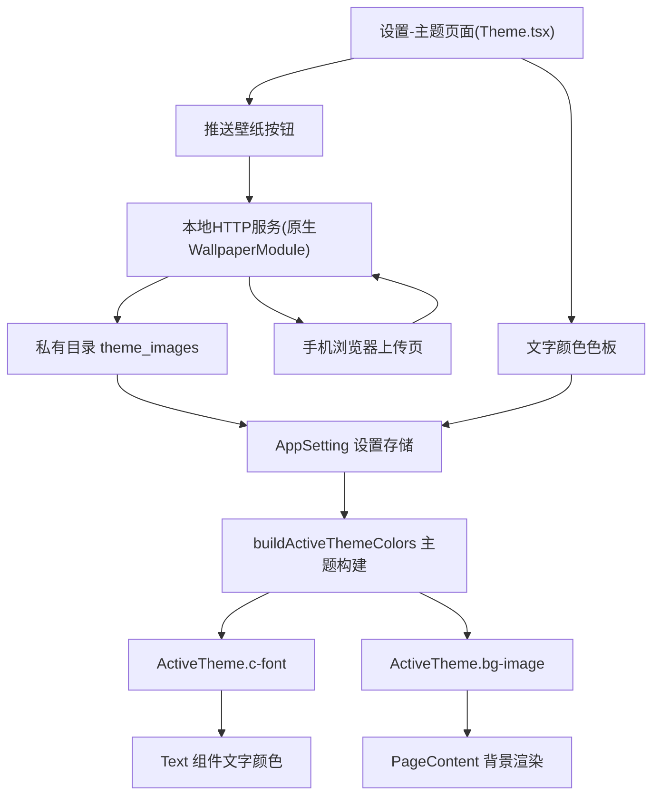

# 设计文档：扫码推送壁纸与文字颜色设置

Feature Name: 2026-08-15-wallpaper-and-font-color
Updated: 2026-08-15

## Description

在"设置-主题"界面新增两个能力：通过手机扫码推送自定义壁纸作为全局应用背景，以及选择软件主文字颜色。壁纸图片由 TV 端本地 HTTP 服务接收，保存到应用私有目录持久化；文字颜色与壁纸设置均存入 AppSetting，重启后恢复。

## Architecture



## Components and Interfaces

### 设置项定义

新增两个 `LX.AppSetting` 字段：

| 字段 | 类型 | 说明 | 默认值 |
|------|------|------|--------|
| `theme.customBgImage` | `string` | 用户推送壁纸在私有目录中的文件路径 | `''` |
| `theme.fontColor` | `string` | 用户选择的主文字颜色 | `''` |

修改文件：
- `src/config/defaultSetting.ts`：增加两项默认值 `''`
- `src/types/app_setting.d.ts`：增加类型声明

### 主题构建

修改 `src/theme/themes/index.ts` 的 `buildActiveThemeColors`：

- `'c-font'` 取值：若 `settingState.setting['theme.fontColor']` 非空则使用该值，否则回退到 `theme.config.themeColors['c-850']`
- `'bg-image'` 取值：若 `settingState.setting['theme.customBgImage']` 非空则使用 `{ uri: 路径 }`，否则沿用原有主题背景逻辑

### 原生本地 HTTP 服务（WallpaperModule）

新增 Android 原生模块 `cn.toside.music.mobile.wallpaper`，用于接收手机上传的壁纸图片：

- **`start(port, dir)`**：启动 `ServerSocket` 监听 `0.0.0.0:port`，上传目录为 `dir`
  - `GET /`：返回内嵌 HTML 上传页（图片选择 + 转 base64 的 JS）
  - `POST /upload`：接收 JSON body `{ name, data }`（data 为 base64），解码后写入 `dir`
- **`stop()`**：关闭 socket，停止接收
- **事件 `wallpaper-uploaded`**：保存成功后向 JS 发送 `{ path }`
- 线程模型：监听线程 + 每连接一个工作线程，使用 `reactContext` 发送事件
- 端口使用动态分配（`ServerSocket(0)` 自动分配），避免固定端口冲突

注册到 `MainApplication.getPackages()`。

### 二维码生成与展示

- 新增依赖 `qrcode-generator`（纯 JS，无原生依赖，TV 端仅生成不解析）
- `UploadWallpaper.tsx` 改造：
  1. 点击"推送壁纸"时调用 `getWIFIIPV4Address`（`src/utils/nativeModules/utils.ts`）获取局域网 IP
  2. 调用原生 `WallpaperModule.start` 获取实际监听端口
  3. 用 `qrcode-generator` 将 `http://<IP>:<端口>/` 编码为 matrix，渲染成黑白格子 View
  4. 显示二维码弹层，附手机同网提示文案
  5. 监听 `wallpaper-uploaded` 事件，收到 `{ path }` 后 `updateSetting({ 'theme.customBgImage': path })` 并关闭弹层
  6. 提供"清除壁纸"操作（`updateSetting` 置空）

### 设置界面

修改 `src/screens/Home/Views/Setting/settings/Theme/index.tsx` 挂载子组件：

1. **UploadWallpaper.tsx**（改造为扫码推送模式）
2. **FontColor.tsx**：参考 `SettingLrcColor.tsx` 的 CheckBox 列表交互，提供预设色板

### 多语言文案

在 `src/lang/zh-cn.json`、`zh-tw.json`、`en-us.json` 三语言中新增（key 必须一致）：
- `setting_basic_theme_upload_wallpaper`
- `setting_basic_theme_upload_wallpaper_tip`
- `setting_basic_theme_clear_wallpaper`
- `setting_basic_theme_font_color`
- 预设颜色名称复用 `play_detail_setting_lrc_color_*` 现有词条或新增词条

## Data Models

```ts
// AppSetting 新增字段
'theme.customBgImage': string  // 私有目录下的壁纸文件路径，'' 表示未设置
'theme.fontColor': string      // 主文字颜色值（如 '#FFFFFF'），'' 表示使用主题默认
```

壁纸文件存储在 `privateStorageDirectoryPath + '/theme_images/'` 目录，文件名使用时间戳生成避免冲突。

二维码内容格式：`http://<IPv4>:<port>/`，同一局域网内手机扫码即可访问上传页。

## Correctness Properties

1. 壁纸文件在原生端仅接受 JSON 中的 base64 图片数据，扩展名白名单（jpg/jpeg/png/webp/bmp）
2. 壁纸设置空值时不覆盖主题自带背景
3. 文字颜色设置空值时不覆盖主题默认文字色
4. 上传失败的临时文件需要清理，避免残留
5. 设置持久化通过现有 `updateSetting` 机制自动保存
6. 服务仅监听局域网接口，不暴露到公网

## Error Handling

| 场景 | 处理 |
|------|------|
| 未连接 WiFi（IP 为 0.0.0.0） | 提示用户连接网络后重试，不启动服务 |
| 端口绑定失败 | 捕获异常并 `toast` 提示用户，服务不启动 |
| 手机上传格式非法 | 原生返回错误 JSON，TV 端保持原背景不变 |
| 保存文件失败 | 清理临时文件、发送失败事件、提示用户 |
| 用户关闭弹层 | 调用 `stop()` 停止服务，释放端口 |

## Test Strategy

1. 在设置-主题界面点击"推送壁纸"，确认显示二维码且内容为局域网地址
2. 手机同网扫码，确认打开上传页并可选择图片
3. 手机上传 jpg/png 图片，确认 TV 全局背景立即变为该图片
4. 上传非法数据，确认被拒绝且背景不变
5. 点击"清除壁纸"，确认恢复主题自带背景
6. 在文字颜色色板选择颜色，确认未指定颜色的文字立即变色
7. 重启应用，确认壁纸与文字颜色设置均保留
8. 切换内置主题后，确认自定义壁纸与文字颜色仍然生效
