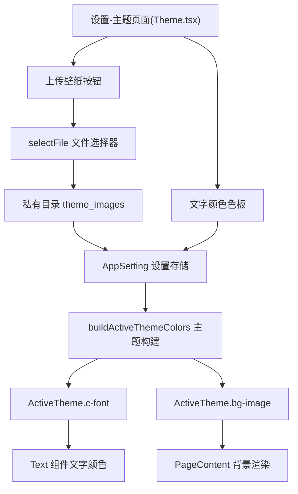

# 设计文档：上传壁纸与文字颜色设置

Feature Name: 2026-08-15-wallpaper-and-font-color
Updated: 2026-08-15

## Description

在"设置-主题"界面新增两个能力：上传自定义壁纸作为全局应用背景，以及选择软件主文字颜色。壁纸图片会被复制到应用私有目录持久化，文字颜色与壁纸设置均存入 AppSetting，重启后恢复。

## Architecture



## Components and Interfaces

### 设置项定义

新增两个 `LX.AppSetting` 字段：

| 字段 | 类型 | 说明 | 默认值 |
|------|------|------|--------|
| `theme.customBgImage` | `string` | 用户上传壁纸在私有目录中的文件路径 | `''` |
| `theme.fontColor` | `string` | 用户选择的主文字颜色 | `''` |

修改文件：
- `src/config/defaultSetting.ts`：增加两项默认值 `''`
- `src/types/app_setting.d.ts`：增加类型声明

### 主题构建

修改 `src/theme/themes/index.ts` 的 `buildActiveThemeColors`：

- `'c-font'` 取值：若 `settingState.setting['theme.fontColor']` 非空则使用该值，否则回退到 `theme.config.themeColors['c-850']`
- `'bg-image'` 取值：若 `settingState.setting['theme.customBgImage']` 非空则使用 `{ uri: 路径 }`，否则沿用原有主题背景逻辑

### 设置界面

在 `src/screens/Home/Views/Setting/settings/Theme/` 目录新增两个子组件：

1. **UploadWallpaper.tsx**
   - 复用 `selectFile`（`src/utils/fs.ts`），`extTypes` 限定为 `['jpg', 'jpeg', 'png', 'webp', 'bmp']`
   - 文件复制到 `privateStorageDirectoryPath + '/theme_images/'`，若目录不存在则 `mkdir`
   - 成功后 `updateSetting({ 'theme.customBgImage': 路径 })`
   - 复用现有 Button 组件，提供"清除壁纸"操作（`updateSetting` 置空）
2. **FontColor.tsx**
   - 参考 `SettingLrcColor.tsx` 的 CheckBox 列表交互，提供预设色板
   - 选择后 `updateSetting({ 'theme.fontColor': 颜色 })`

修改 `src/screens/Home/Views/Setting/settings/Theme/index.tsx` 挂载以上两个子组件。

### 多语言文案

在 `src/lang/zh-cn.json` 与 `src/lang/en-us.json` 中新增：
- `setting_basic_theme_upload_wallpaper`
- `setting_basic_theme_upload_wallpaper_tip`
- `setting_basic_theme_clear_wallpaper`
- `setting_basic_theme_font_color`
- 预设颜色名称复用 `play_detail_setting_lrc_color_*` 现有词条或新增词条

## Data Models

```ts
// AppSetting 新增字段
'theme.customBgImage': string  // 私有目录下的壁纸文件路径，'' 表示未设置
'theme.fontColor': string      // 主文字颜色值（如 '#FFFFFF'），'' 表示使用主题默认
```

壁纸文件存储在 `privateStorageDirectoryPath + '/theme_images/'` 目录，文件名使用时间戳生成避免冲突。

## Correctness Properties

1. 壁纸文件只允许图片扩展名（jpg/jpeg/png/webp/bmp）
2. 壁纸设置空值时不覆盖主题自带背景
3. 文字颜色设置空值时不覆盖主题默认文字色
4. 上传失败的临时文件需要清理（unlink），避免残留
5. 设置持久化通过现有 `updateSetting` 机制自动保存

## Error Handling

| 场景 | 处理 |
|------|------|
| 用户取消文件选择 | `selectFile` 返回空，保持原设置不变 |
| 目录创建失败 | 捕获异常并 `toast` 提示用户 |
| 文件复制失败 | 捕获异常、清理临时文件、提示用户 |
| 选择的文件扩展名不匹配 | 提示用户文件类型不符 |

## Test Strategy

1. 在设置-主题界面点击"上传壁纸"，选择 jpg/png 图片，确认全局背景立即变为该图片
2. 选择非图片文件，确认被拒绝且背景不变
3. 点击"清除壁纸"，确认恢复主题自带背景
4. 在文字颜色色板选择颜色，确认未指定颜色的文字立即变色
5. 重启应用，确认壁纸与文字颜色设置均保留
6. 切换内置主题后，确认自定义壁纸与文字颜色仍然生效
